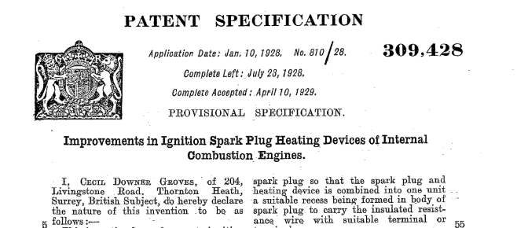
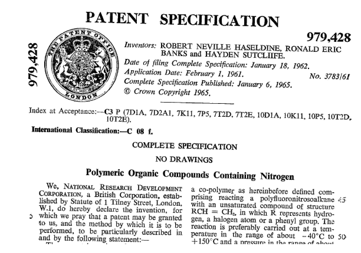
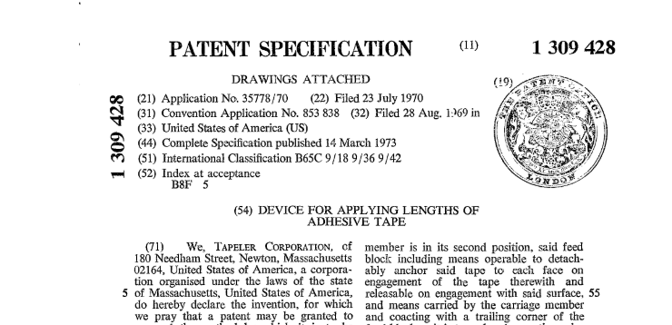
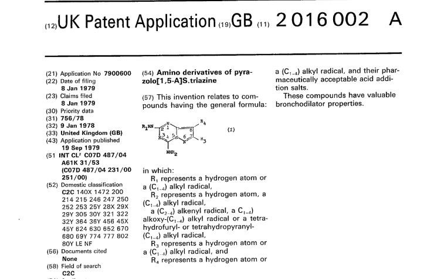

# ANNOTATION GUIDELINES

## Preliminary comments

The patent corpus that we consider for GB has two types of formats and spans the period 1893-1980.
The formatting of UK patent documents have evolved in time but only modestly. Typically, until patent number GB2000001, the first paragraph of the text contains most of the relevant information, which are completed by the header, whose content changes slightly over time. See Figures 1, 2 and 3 for different examples.

From GB2000001 onward, the information are located in the front-page of the patent in a structured way (see Figure 4 for an example). This only concerns 23,889 patent documents as we stop the analysis in 1980.

More on GB patents numbering

- Prior to 1916, patent number is given by a number preceded by the *year of application*
- From 1916, patents are numbered from 100001 to 1605470 and then from 2000001 onward.
- The last application we consider is 2023380

### *Format 1*, from 1894 to 1979

In the first format, from 1894 to 1979, all the information is given in the first paragraph, which starts by "I, " or "We, " and usually ends with "do hereby declare the nature of this invention to be as follows" or "for which we pray that a patent may be granted to us..."

We extract 5 different "entities" from the body of GB patents.

Entity|Content|E.g.
---|---|---
`PERS`| Person full name | Maxim Hanson Hersey `PERS`, Lighting Engineer
`ORG`| Firm full name | We, The Convex Incandescent Mantle Company Limited `ORG`, Manufacturers
`CIT`| The origin of the firm or citizenship of the person | a subject of the king of Great Britain and Ireland `CIT`,
`LOC`| Location of the person/firm| Maxim Hanson Hersey, Lighting Engineer, of 145, Bethune Road, Amhurst Park, London N. `LOC`.
`OCC`| Occupation of the person | Maxim Hanson Hersey, Lighting Engineer `OCC`.

These entities are tied together with 3 types of relations.

Relation|Content|E.g.
---|---|---
`CITIZENSHIP`| Links an `ORG`/`PERS` to its `CIT` | Maxim Hanson Hersey `PERS`-->`CITIZENSHIP`-->subject of the king of Great Britain and Ireland `CIT`
`LOCATION`|Links an `ORG`/`PERS` to its `LOC` | Maxim Hanson Hersey `PERS`-->`LOCATION`-->145, Bethune Road, Amhurst Park, London N. `LOC`
`OCCUPATION`|Links an `PERS` to its `OCC`| Maxim Hanson Hersey `PERS`-->`OCCUPATION`-->Lighting Engineer `OCC`

Other meta-data in GB patents

The header contains some specific information including:

- the publication date
- the acceptance date
- the application number
- the publication number
- the title
- the technological class
- the name of the inventor(s) - in some instance

### Format 2

In the second format, restricted to the year 1979, the information are structured in the front page of the patent. For these patents, the identity of the inventor and the assignee are clearly stated, but only the location of the assignee is given.

## Entities

### Format 1

#### The tag `PERS`

The tag `PERS` refers to the full name of a *patentee* person which can or cannot be directly presented as the inventor. This name usually follows "I, " or "We, " and is given in capital letters.

##### Specific cases

- *Inventor name in the header*: The name of the inventor can also be specified in the header, preceded by the mention "Inventor(s):" and usually in capital letters. In this case, we label the inventor(s) as `PERS`. See example 2.
- *Third party*: In the rare case where the inventor uses a third party to file the application (deceased, mandated), we don't tag the third party person. See example 3 where we do not tag "HAROLD WADE" as a `PERS` because the context tells us that he is not the inventor.

##### Examples

**Example 1: *standard case*, from patent GB150481A**
> We, ANTHONY FULFORD READ `PERS` , 18, Fown Terrace, Brighton, Manufacturers' Agent, and HAROLD NORMAL READ `PERS` , 18 Down Terrace, Brighton, Manufacturer's Agent.

**Example 2: *inventor name in the header*, from patent GB1222048A**
> Inventors WALTER BUNGARD `PERS` and HANS ZEHNPFENNIG `PERS`  
>  Improvements in or relating to bearings and bearing liners  
> We, T.H. GOLDSCHMIDT A.G., a body corporate organised under the Laws of Germany,

**Example 3: *third party*, from patent GB191413361A**
> (A communication from CHARLES LOUIS MICHOD `PERS`, Manufacturer, of Chicago Heights, Illinois, United States of. America.)  
> I, HAROLD WADE, Chartered Patent Agent, of 111 and 112, Hatton Garden, London, E.C., do hereby declare...

**Example 4: *dead*, from patent GB1046893A**
> We, LEVI CLEWS `PERS` of 140, Finch Road, Birmingham 19, a British Subject, and FRANCES MABEL GROVES, a British subject, of 41 Ettington Road, Aston, Birmingham 6, legal representative of the late Alfred Groves `PERS` deceased, a British subject of 140 Finch Road, Birmingham 19, do hereby declare...

**Example 5: *assignees of*, from patent GB664753**
> We, EASTMAN KODAK COMPANY, a Corporation organised under the laws of the State of New Jersey, United States of Aiuevica, of 343, State Street, Rochester, New York, United States of America (Assignees of Fred Waller `PERS`, a citizen of the United States of America, of 1925, New York Avenue, Huntington Station, New York, United States of America)

#### The tag `ORG`

The tag `ORG` refers to the full name of the organisation which owns the patent. This name usually follows "We, " and is given in capital letters.

##### Specific cases

- *Third party*: Similarly to the tag `PERS`, we do not tag a third party as an `ORG` if the context tells us that this is not a patentee.
- *Former name*: Do not label the former name of the company when it is given. See example 3.

##### Examples

**Example 1: *standard case*, from patent GB848511A**

> We, LONZA ELECTRIC AND CHEMICAL WORKS LIMITED `ORG`, a Swiss Body Corporate of Aeschenvorstadt 72, Basel, do hereby declare the invention for which we pray...

**Example 2: *standard case*, from patent GB757350A**

> We, W.S. BARRETT & SON LIMITED `ORG` a British Company of 106-108, West Street, Boston, Lincolnshire, do hereby declare...

**Example 3: *former name*, from patent GB786015A**

> We, THE SCHOLL MFG Co LIMITED `ORG`, formerly The Scholl Manufacturing Company Limited, a British Company, of 190 St John Street, London, E.C l, England, do hereby declare...

#### The tag `CIT`

The tag `CIT` refers to the citizenship of a `PERS` or by the origin of a `ORG`. In the first case, it is usually given in the form "A British citizen" or "A subject of the King of Britain". In the second case, it is usually given in the form "A company of Sweden". The full sequence must be tagged, that is, including "a citizen", "a subject" or "a company".

##### Specific cases

- *ORG from US*: When a company is registered in the US, the sequence can be long and include the state of origin. See example 3.

##### Examples

**Example 1: *origin of ORG*, from patent GB784551A**
> We, PROGRESS MERCANTILE COMPANY LIMITED, a British Company `CIT`, formerly of 19 Malden Crescent London, N.W.1 ...

**Example 2: *origin of PERS*, from patent GB500752A**
> I, HAROLD FREDERICK MAGNUS, of 79 to 82, Fore Street, London E.C.2, British Subject `CIT`, do hereby declare...

** Example 3: *ORG from the US*, from patent GB388752**
> We, ASSOCIATED TELEPHONE & TELEGRAPH COMPANY, of 1033, West Van Buren Street, Chicago, Illinois, United States of America, a corporation organised under the laws of the State of Delaware, United States of America `CIT`, do hereby declare...

#### The tag `OCC`

The tag `OCC`refers to the occupation of a `PERS` or in some rare case of the type of a firm.

##### Examples

**Example 1: *OCC of PERS* from patent GB163765A**
> I, HENRY ART KING, Mechanical Draftsman `OCC`, residing at No. 2012, Linden Avenue et the City of Baltimore, and State of Maryland...

**Example 2: *OCC of PERS and ORG* from patent GB145878A**
> We, M. HOWLETT AND COMPANY LIMITED, of 140 Hockley Hill, Birmingham, Manufacturers `OCC`, and JAMES DOLPHIN of 23, Carless Avenue, Harborne, Birmingham, Works Manager `OCC`, do hereby declare...

#### The tag `LOC`

The tag `LOC` refers to the full location sequence either of a tag `PERS` or a tag `ORG`. The address can be given as a full sequence with street number, street name, city, county and country. It can also be simply given by the name of the city/town/village and county (see example 2), or by a postcode (see example 3). In some cases, the location refers to a specific building (see example 4) or university (example 5) and in some other cases, the name of a nearby city is specified (see example 6).

##### Specific cases

- *Non-patentee location*: the tag `LOC` should only be used to label the address of the inventor or the assignee based on the context (i.e. an entity `PERS` or `ORG`).

##### Examples

**Example 1: *full address*, from patent GB1910000882A**
> Improvements in or relating to Tobacco Pipes, Cigar and Cigarette Holders.
> I, FRANK WOOD, of 4, Rawes Street, Burnley, in the County of lancaster `LOC`, Commission Agent, do hereby ...

**Example 2: *city+*, from patent GB850480**
> We, DEPARTMENT of MINES, a Department of the Provincial Government of Quebec, Quebec City, Province of Quebec, Canada`LOC`,, do hereby...

**Example 3: *post-code* from patent GB1254482**
> Improved Cylinder Lock Mechanism.
> We OY WARTSILA AB, a Finnish Company of Box 10230, Helsinki 10, Finland `LOC`, do hereby...

**Example 4: *building+*, from patent GB937358A**
> We, MARCONI'S WIRELESS TELEGRAPH COMPANY LIIMITED of English Electric House, Strand, London, W.C.2 `LOC` , a British Company, do hereby declare...

**Example 5: *university*, from patent GB332692A**
> I, ARTHUR SIMEON WATT, a citizen of the United States of America, of Ohio University, in the City of columbus, State of Ohio, United States of America`LOC` , do hereby declare...

**Example 6: *former address*, from patent GB1018822A**

> I, HUSSAIN ALI MOONTASIR, a citizen of the British Commonwealth, of 29, Beechwood Avenue, Kew, Surrey `LOC`, (formerly of 409, Mistery Chambers opposite Strand Cinema,
Colaba, Bombay 5, India), do hereby declare...

**Example 7: *nearby city*, from patent GB1114180**

> I, DENNIS ROBERT CHASE, a British Subject, of 29 St John's Road, Locksheath, Near Southampton, Hampshire `LOC`.

## Relationships

See [XX\_REL\_ANNOTATION\_GUIDELINES.md](./XX_REL_ANNOTATION_GUIDELINES.md).

## Examples

#### Figure 1: GB309428A

#### Figure 2: GB979428A

#### Figure 3: GB1309428A

#### Figure 3: GB2016002A

