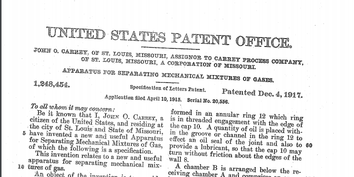
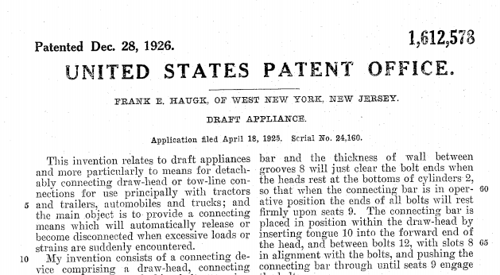
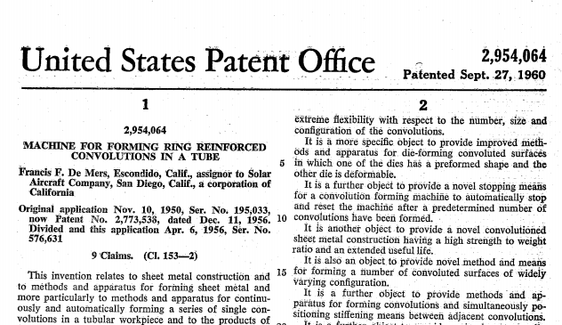
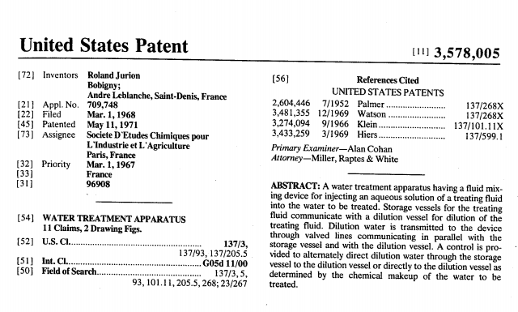

# ANNOTATION GUIDELINES

## Preliminary comments

The patent corpus that we consider for US has 4 types of formats and spans the period 1836-1980.

The formatting is different from one format to the next one. In publication prior to US1248454A, the relevant information are contained in the first paragraph and in the header (format 1), it is subsequently only contained in the header. See Figures 1,2, 3 and 4 for an example of each format type.
From publication US3930271A onward, we use information provided by the USPTO in the Patentsview database.

### *Format 1*, from 1836 to 1926

This first format starts with patent US1A and ends with patent US1583766A published in 1926, it is characterized by the presence of the item "be it known" at the top of the text.

We extract 4 different "entities".

| Entity | Content                           | E.g.                                                         |
| ------ | --------------------------------- | ------------------------------------------------------------ |
| INV    | Inventor full name                | Be it known that I, JAMES M. GARDINER `INV`, ... |
| ASG    | Assignee full name                | ASSIGNOR OF ONE-HALF TO SMITH FULMER `ASG` |
| LOC    | Location of the inventor/assignee | residing at Mikkalo, in the county of Gilliam and State of Oregon `LOC` |
| CIT    | Citizenship of inventor           | JOHN SCHLATTER, a citizen of United States `CIT` |

Entities are tied together with 2 types of relations.

| Relation      | Content                         | E.g.                                                         |
| ------------- | ------------------------------- | ------------------------------------------------------------ |
| `LOCATION`    | Links an `INV/ASG` to its `LOC` | SEDWARD WILLIAM YOUNG `INV`--`LOCATION`<--Tytherley, Wimborne, Dorset, England `LOC` |
| `CITIZENSHIP` | Links an `INV/ASG` to its `CIT` | WILLIAM H. BAKER `INV`--`CITIZENSHIP`<--citizen of the United States`CIT` |

### *Format 2*, from 1926 to 1933

This second format starts with patent US1583767A and ends with patent US1920166A. All the information are contained in a header just below the title.

We extract 4 different "entities".

| Entity | Content                           | E.g.                                                         |
| ------ | --------------------------------- | ------------------------------------------------------------ |
| INV    | Inventor full name                | PHILIP B. ROHNER `INV` OF CARROLL, IOWA |
| ASG    | Assignee full name                | ASSIGNOR TO NICHOLAS POWER COMPANY, INC. `ASG`, OF NEW YORK, N. Y., SMITH FULMER `ASG` |
| LOC    | Location of the assignee/inventor | WARBEN NOBLE AND LEON W. PITTMAN, OF  DETROIT, MICHIGAN `LOC` |
| CIT    | Citizenship of assignee           | STOW MANUFACTURING COMPANY, OF BINGHAMTON, NEW YORK, A CORPORATION OF NEW YORK `CIT` |

Entities are tied together with 2 types of relations.

| Relation      | Content                         | E.g.                                                         |
| ------------- | ------------------------------- | ------------------------------------------------------------ |
| `LOCATION`    | Links an `INV/ASG` to its `LOC` | ISIDOR EDWARD BRENNER `INV`--`LOCATION`<--CHICAGO, ILLINOIS `LOC` |
| `CITIZENSHIP` | Links an `ASG` to its `CIT`     | EASTERN EXPANDED METAL COMPANY  `ASG`--`CITIZENSHIP`<--CORPORATION . OF MASSACHUSETTS `CIT` |

### *Format 3*, from 1933 to 1971

This third format starts with patent US1920167A and ends with patent US3554066A. The information is still in the header under the title but adopts a different formatting. Note that the ending point for format 3 is not very clear as a few publications continue to have a similar format after US3554066A, although most of them have format 4.

We extract 4 different "entities".

| Entity | Content                           | E.g.                                                         |
| ------ | --------------------------------- | ------------------------------------------------------------ |
| INV    | Inventor full name                | Vincent S. Farricielli `INV` , New Haven, Conn. |
| ASG    | Assignee full name                | assignor, by mesne assignments, to Mohasco Industries, Inc. `ASG`, Bridgeport, Pa. |
| LOC    | Location of the assignee/inventor | Hugh Graham Webster and Ray W. Thomas, Detroit, Mich `LOC` |
| CIT    | Citizenship of assignee           | , assignors to Esso Research and Engineer ing Company, a corporation of Delaware `CIT` |

Entities are tied together with 2 types of relations.

| Relation      | Content                         | E.g.                                                         |
| ------------- | ------------------------------- | ------------------------------------------------------------ |
| `LOCATION`    | Links an `INV/ASG` to its `LOC` | George Norwitz`INV`--`LOCATION`<--Philadelphia, Pa.`LOC` |
| `CITIZENSHIP` | Links an `ASG` to its `CIT`     | The De Laval Separator Company `ASG`--`CITIZENSHIP`<--Corporation of New Jersey `CIT` |

### *Format 4*, from 1971

In this fourth format, the information is structured in the front page of the patent. For these patents, the identity of the inventor and the assignee are clearly stated along with their addresses. We consider patent US3554067A to be the first patent of Format 4, but some publications are closer to format 3 even after this number. We consider all cases.

We extract 4 different "entities".

| Entity | Content                           | E.g.                                                         |
| ------ | --------------------------------- | ------------------------------------------------------------ |
| INV    | Inventor full name                | Inventor: Vincent S. Farricielli `INV` , New Haven, Conn. |
| ASG    | Assignee full name                | Assignee: Hannes Marker `ASG`, Garmisch-Partenkirchen Germany. 
| LOC    | Location of the assignee/inventor | Theodore A. Rich Scotia, N.Y. `LOC` |

Entities are tied together with 1 type of relations.

| Relation      | Content                         | E.g.                                                         |
| ------------- | ------------------------------- | ------------------------------------------------------------ |
| `LOCATION`    | Links an `INV/ASG` to its `LOC` | Willi Wolff `INV`--`LOCATION`<--Schildgen, Germany `LOC` |

## Named Entity recognition

### Format 1

#### The tag `INV`

The tag `INV` refers to the full name of an inventor. This is a person that is not referred to as the assignee and is sometimes specifically referred to as the inventor.

##### Specific cases

* Inventor in the header (example 1)
* Inventor in the text (example 2)

##### Examples

**Example 1: *Inventor in header*, from patent US1108402A**

>PAUL SCHMITZ `INV`, OF COLOGNE-NIEHL, GERMANY

**Example 2: *Inventor in text*, from patent US913422A**

>Be it known that I, CHARLES M. McConrnok `INV`

#### The tag `ASG`

The tag `ASG` refers to the full name of the assignee, usually a person but can also be a firm.

##### Specific cases

* Assignee as a person (example 1)
* Assignee as a firm (example 2)

##### Examples

**Example 1: *person*, from patent US1030738A**

>ASSIGNOR OF NINE THIRTY-SECONDS TO  JOSEPH ANTOINE HILAIRE HEBERT `ASG`

**Example 2: *firm*, from patent US1488673A**

>ASSIGNOR TO MIEHELE PRINTING PRESS & MANUFACTURING COMPANY `ASG`

#### The tag `LOC`

The tag `LOC` refers to the full location of an inventor or an assignee. The granularity of the location information is the city in the standard case. In some rare instances, the full address is given, in which case only the city/county/state/country must be labeled.

##### Specific cases

* _Location in header_: the location is given in the header in the form: CITY/STATE or CITY/COUNTRY (example 1)
* _Location in text_: the location is also given in the text following the name of the inventor. The location is usually given as "in [CITY] in the county of [COUNTY] and state of [STATE]" (example 2)
* _Detailed address_: in some rare cases, a more detailed information is given such as the borough or the full postal address. In which case only information more aggregated than city is labeled (example 3)

##### Examples

**Example 1: *location in header*, from patent US1030738A**

>WILLIAM. V. B. AMES, OF CHICAGO, ILLINOIS `LOC`

**Example 2: *location in text*, from patent US1530731**

>resident of Osceola in the county of Clarke and State of Iowa `LOC`

**Example 3: *detailed address*, from patent US1143189**

>a resident of the borough of Brooklyn, county of Kings, city and State of New York `LOC`

#### The tag `CIT`

The tag `CIT` refers either to the citizenship of the inventor (or assignee when applicable) or to the legal origin of an assignee firm. The initial _a_ ("a firm", "a citizen") must not be labeled.

##### Specific cases

* _Citizenship of the inventor_: the citizenship usually follows  "a citizen of" (example 1), or "a subject of" (example 2)
* Assignee as a firm (example 3)

##### Examples

**Example 1: *Citizen of*, from patent US1030738A**

>CHARLES B. CLEMENTS, a citizen of the United States `CIT`

**Example 2: *Subject of*, from patent US1244286A**

>Joseph C. Breinl, a subject of the Emperor of Austria `CIT`

**Example 3: *Firm*, from patent US1488673A**

>AMERICAN GRAPHOPHONE COMPANY, OF BRIDGEPORT, CONNECTICUT, A CORPORATION OF WEST VIRGINIA `CIT`

### Format 2

#### The tag `INV`

The tag `INV` refers to the full name of an inventor. This is a person that is not referred to as the assignee and is sometimes specifically referred to as the inventor.

##### Specific cases

##### Examples

**Example 1: *Standard Case*, from patent US1634855**

> OSCAR SIVERTZEN `INV`, OF TRONDHJEM, NORWAY

#### The tag `ASG`

##### Specific cases
- *Person Assignee*: Some patents report that a person (not the inventor) has some rights over the patent. See example 2.

##### Examples
**Example 1: *Standard Case*, from patent US198045**

>MARCUS B.BERHMAN, OF BROOKLYN, NEW YORK, ASSIGNOR TO  THE LOX SEAL CORPORATION `ASG`, OF BROOKLYN, NEW YORK, A CORPORATION OF NEW YORK

**Example 2: *Person Assignee*, from patent US1908223**
>LOFTUS B.CUDDY, OF SEWICKLEY, PENNSYLVANIA, ASSIGNOR OF ONE-HALF TO KINLEY J.TENER`ASG`, OF PITTSBURGH, PENNSYLVANIA

#### The tag `LOC`

##### Specific cases

* *Location of  inventor and assignee* (example 1)

* *Location of the inventor*: in the case where there is no assignee, only the location of the inventor is available (example 2). But in some case, the location of the assignee is not given even if there is an assignee (example 3).

##### Examples

**Example 1: *Location of inventor and assignee*, from patent US1861234**

>WILLIAM W.KNIGHT, OF CICERO, ILLINOIS `LOC`, ASSIGNOR TO ROTH RUBBER COMPANY, OF  CICERO, ILLINOIS `LOC`, A CORPORATION OF ILLINOIS

**Example 2: *Location of inventor, from patent US1690033**

>WARREN NOBLE, OF DETROIT, MICHIGAN`LOC`

**Example 3: *Location of inventor with assignee*, from patent US1700112**

>WILLIAM E. BEATTY, OF LAUREL HILL, NEW YORK `LOC`, ASSIGNOR TO ELEVATOR, SUPPLIES COMPANY, INC., A CORPORATION OF NEW JERSEY.

#### The tag `CIT`

The tag `CIT` refers either to the citizenship of the assignee i.e. the legal origin of the firm when applicable. The initial _a_ ("a firm", "a corporation") must not be labeled.

##### Specific cases

##### Examples

**Example 1: *Standard Case*, from patent US1832319**

> ASSIGNMENTS, TO UNION CARBIDE AND CARBON RESEARCH LABORATORIES, INC, OF NEW YORK, N.Y., A CORPORATION OF NEW YORK `CIT`

### Format 3

#### The tag `INV`
The tag `INV` refers to the full name of an inventor. This is a person that is not referred to as the assignee and is sometimes specifically referred to as the inventor.

##### Examples
**Example 1: *Standard Case*, from patent US2924015**

> Richard M.Gurries`INV`, San Jose, Calif.

#### The tag `ASG`
The tag `ASG` refers to the full name of the assignee, usually a person but can also be a firm.

##### Examples
**Example 1: *Standard Case*, from patent US2831921**

>Samuel P.Morgan, Jr., Morristown, NJ, assignor to  Bell Telephone Laboratories, Incorporated`ASG`, New York, NY, a corporation of New York

#### The tag `LOC`

The tag `LOC` refers to the location of the inventor or assignee and is given by the city and state. The state itself is given as the [US Government Printing Office](https://en.wikipedia.org/wiki/United_States_Government_Publishing_Office) code (GPO).

##### Examples
**Example 1: *Standard Case*, from patent US2224950**
>Alfred Burke, New York, N.Y`LOC`

#### The tag `CIT`

The tag `CIT` refers either to the citizenship of the assignee i.e. the legal origin of the firm when applicable. The initial _a_ ("a firm", "a corporation") must not be labeled.

##### Examples

**Example 1: *Standard Case*, from patent US2924016**
> Richard Diener, Berlin-Hermsdorf, Germany, assignor to Berliner Maschinenbau-Actien-Gesellschaft, Berlin, Germany, a corporation of Germany`CIT`

### Format 4

#### The tag `INV`

The tag `INV` refers to the full name of an inventor.

##### Specific cases

* _Format 3:_ the format 3 corresponds to a format that is very close the format 3 describes above (see example 1)
* _Format 4:_ the standard case which is structured with a dedicated field named: inventor(s) (example 2)
* _Deceased:_ in some rare case, the inventor is dead and an administrator is designated. Only the (dead) inventor should be labeled then (see example 3)

##### Examples

**Example 1: *Format 3*, from patent US3719374A**
> Francisco M. Serrano`INV`, Paris, France, assignor to

**Example 2: *Format 4*, from patent US3702536A**
> Inventor: John W. Gregory`INV`, Middleburg Heights, Ohio 

**Example 3: *Decreased*, from patent US3718608A**
> Inventors: Daniel W. Mason`INV`, Peabody; Henry
H. Nester`INV`, deceased, late of Peabody, Mass. by Dianne L. Nester, administratrix

#### The tag `LOC`

The tag `LOC` refers to the location of the inventor or assignee and is given by the city and state. 

##### Specific cases

* _Format 3:_ the format 3 corresponds to a format that is very close the format 3 describes above (see example 1)
* _Format 4:_ the standard case which is structured. The location appears in the field inventor and/or assignee (example 2)
* _all of / both of_: in some cases with multiple inventors, the location is designated in two times (INV1, [CITY] and INV2, [CITY], both of [STATE]) (see example 3).
* _Full address:_ in some cases, the full postal address is given. In this case, only the city and more aggregated geographical entities should be labeled (see example 4).

##### Examples

**Example 1: *Format 3*, from patent US3702735A**
> Andrew E. Potter, Jr., Houston, Tex`LOC`

** Example 2: *Format 4*, from patent US3692296**
> Inventor: William W. Higginbotham, Monroe, Mich.`LOC`

** Example 3: *all of*, from patent US3697893A**
> James L. Faustlin, Plano`LOC`; Eliseo Saenz, Garland`LOC`, both of Tex`LOC`

** Example 4: *full address*, from patent US3624981A**
> Arthur Fischer, Altheimer Strasse 219, Tumlingen , Germany`LOC`

#### The tag `ASG`

The tag `ASG` refers either to the name of the assignee.

##### Specific cases

* _Format 3:_ the format 3 corresponds to a format that is very close the format 3 describes above (see example 1)
* _Format 4:_ the standard case which is structured with a dedicated field named: assignee (example 2)
* _The United States of America:_ when the assignee is part of the government, the assignee is referred to as "the United States of America, as represented by XX". In such a case, only "the United States of America" should be labeled (example 3)
do not tag the representant

##### Examples

**Example 1: *Format 3*, from patent *US3608112A*
> Finn T. Ergens, Milwaukeee, Wis., assignor to Outboard Marine Corporation`ASG`, Milwaukee, Wis. 

** Example 2: *Format 4*, from patent *US3621396A*
>  Assignee: Bell Telephone Laboratory, Inc.`ASG`

**Example 3: *USA*, from patent US3722202A**
> Assignee: The United States of America`ASG` as represented by the Secretary of Agriculture

## Relationships

See [XX\_REL\_ANNOTATION\_GUIDELINES.md](./XX_REL_ANNOTATION_GUIDELINES.md).

## Examples

#### Figure 1: US1248454

#### Figure 2: US1612578

#### Figure 3: US2954064

#### Figure 4: US-3578005

