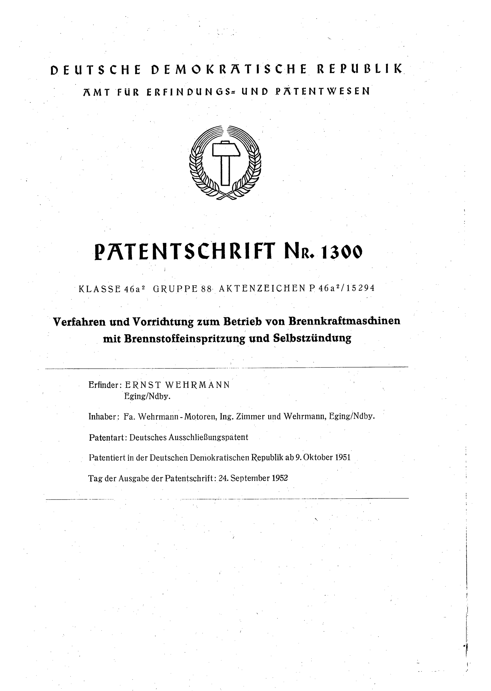
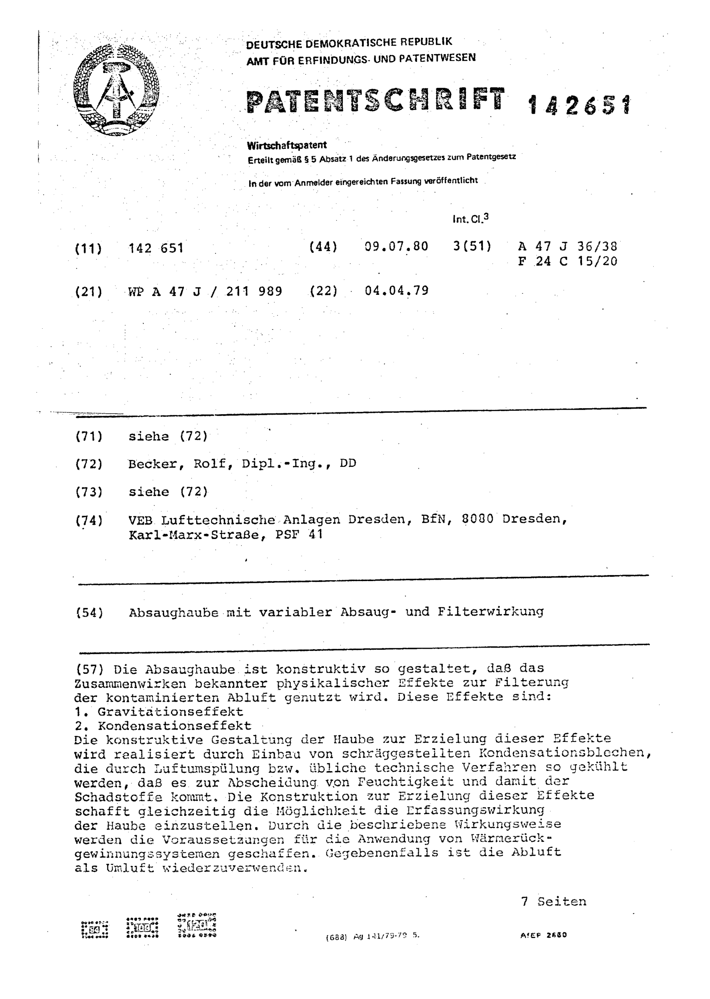

# ANNOTATION GUIDELINES

!!! warning
    GitHub markdown does not fully support visual annotation components (e.g. entity boxes) used below. We invite user interested in the annotation guidelines to download the documents and open it in a development environment supporting extended markdown syntax (e.g. MacDown, PyCharm, etc) and/or save it as a pdf.

## Preliminary comments

The patent corpus we consider for East Germany (the German Democratic Republic) has 2 format categories and spans the period 1950-1992.

### *Format 1*, from to DD1 to DD123499.

This format spans the period 1951-1976.

#### Information display

The document has a header with its publication number ("*Patentschrift Nr*").
The assignee is referred to as "*Inhaber*" while the inventor is referred to as "*Erfinder*". When the same person is both the assignee and the inventor, he might referred to as "*Erfinder zugleich Inhaber*".

Well often, a geographical indication is given with the name of the assignee or the inventor. Typically, this is the name of a city (*e.g* Leipzig). It can be followed by the name of the country (especially when the latter is not Germany). The name of the city is not always given though (*cf* DD79836).

Within this format, some minor changes occur over time.
For instance, the specifically German technological class is reported up until patent DD117152, after which only the international class (IPC) is reported on the document.
Some patents will have a body of text in their first page, while others don't, but information we are interested in will always be in the header.

#### Information extraction

We extract 4 different "entities" from the header of DD patents in format category 1.

Entity|Content|E.g
---|---|---
`ASG`| Assignee full name | Inhaber: Rhône Poulenc S.A`ASG`, Paris (Frankreich).
`INV`| Inventor full name (*Erfinder*) | Erfinder: Dr. Karl Jellinek`INV`, WD
`LOC`| Location of the assignee/inventor| Erfinder: Jean Auguste Phelisse, Lyon (Frankreich)`LOC`.
`OCC`| Occupation of the assignee/inventor (academic title) | Dr.`OCC` Elisabeth Kob, WD.

These entities are tied together with 2 types of relations.

| Relation     | Content                          | E.g.                                                         |
| ------------ | -------------------------------- | ------------------------------------------------------------ |
| `LOCATION`   | Links an `ASG`/`INV` to a `LOC`  |  Rhône Poulenc S.A `ASG`-->`LOCATION`-->Paris (Frankreich)`LOC` |
| `OCCUPATION` | Links an `ASG`/`INV` to an `OCC` | Dr `OCC`<--`OCCUPATION`<--Elisabeth Kob `ASG` |

### *Format 2*, from DD123500 onwards.

#### Information display

In this new format, relevant information are given in slots associated with a number.

For instance, the number 51 announces the (CPC) international technological class of the invention. The number 54 gives the
title of the invention.

The number 72 announces information about the inventor: identity and geographical information. The number 44 indicates the publication date.

The number 71 announces the applicant/assignee but sometimes refers to another slot to signal that this particular slot already contains the name of the applicant (*e.g*, DD126868, DD126858). In particular, a foreign assignee is more likely to be reported in line 73. Line 74 contains the name (and well often, the location) of the legal representative, which we do not tag.

#### Information extraction

We extract 4 different "entities" from the header of DD patents in format category 2.

Entity|Content|E.g
---|---|---
`ASG`| Assignee full name | Maschinenfabrik Köppern GmbH & Co KG`ASG`, Hattingen, DE
`INV`| Inventor full name (*Erfinder*) | (72) Bergendahl, Hans-Georg `INV`, DE
`LOC`| Location of the assignee/inventor| Knieling, Norbert, Dipl-Phys., 12439 Berlin, DE`LOC`.
`OCC`| Occupation of the assignee/inventor (academic title) | Knieling, Norbert, Dipl-Phys.`OCC`, 12439 Berlin, DE.

These entities are tied together with 2 types of relations.

| Relation     | Content                          | E.g.                                                         |
| ------------ | -------------------------------- | ------------------------------------------------------------ |
| `LOCATION`   | Links an `ASG`/`INV` to a `LOC`  |  Maschinenfabrik Köppern GmbH & Co KG `ASG`-->`LOCATION`--> Hattingen, DE `LOC` |
| `OCCUPATION` | Links an `ASG`/`INV` to an `OCC` |  Lämmer, Hans-Georg `ASG`-->`OCCUPATION`-->Dipl-Ing. `OCC` |

## Entities

### Format 1

#### `INV`

##### General case

The tag `INV` refers to the full name of an inventor. This is a person that is not referred to as the assignee and is specifically referred to as the inventor (*Erfinder*).

##### Specific cases

- *Inventor only*: some early patents report an inventor but no assignee. We tag the inventor as it is mentioned nonetheless. See example 2.
- *Secret inventor*: in some patents, it is specifically mentioned  that the inventor remains anonymous. In this case, we do not tag anything. See example 3.
- *Inventor=Assignee*: sometimes, the inventor and the assignee are the same person and the document won't repeat the name; this may be signalled by the phrase "*Erfinder zugleich Inhaber*". In this case, we tag the name only as the inventor, because a single group of words cannot be tagged twice. See example 4.

!!! example "Examples"

    1. *Standard Case* with a person, from patent DD79836

        Erfinder: Wilhelm Uhrig`INV`, WD

    2. *Inventor only*, from patent DD5076

        Erfinder: Dr ALEXANDER PRANSCHKE`INV`, Schwarzheide.
        Dr ERWIN SAUTER`INV`, Schwarzheide.

    3. *Inventor only*, from patent DD4075

        Erfinderbenennung ist ausgesetzt.

    4. *Inventor=Assignee*, from patent DD15399

        Erfinder zugleich Inhaber: Zalter Gleißner`INV`, Weißenfeis (Saale)

#### `ASG`

##### General case

The tag `ASG` refers to the full name(s) of the person(s) or firm(s) who own(s) the patent rights.

##### Specific cases

- *Rechtsträger*: Some patents distinguish between *Inhaber* and *Rechtsträger*: we keep tagging the *Inhaber* person as the assignee. See example 2.

!!! example "Examples"

    1. *Standard Case* with a firm, from patent DD79836

        Inhaber:  Dr. Plate GmbH`ASG`, Bonn, WD.

    2. *Rechtsträger*, from patent DD33554

        Erfinder: Manfred Gerlach, Dresden; Kurt Jäger, Dresden; Dipl-Ing. Gerhard Kasche, Dresden.

        Inhaber: Eigentum des Volkes`ASG`; Kurt Jäger`ASG`, Dresden; Dipl-Ing. Gerhard Kasche`ASG`, Dresden.

        Rechtsträger: VEB Gasturbinenbau und Energiemaschinenentwicklung Pirna, Pirna.

#### `LOC`

##### General case

The tag `LOC` refers to the full location sequence of an assignee or inventor.
In some patents, no location is reported (see DD86584).

##### Specific cases

- *District*: The patents might report the district within a given city, which we tag along. See example 3.

!!! example "Examples"

    1. *Standard Case* with a location for the (foreign) assignee and a location for the (foreign) inventor, from patent DD76817

        Erfinder: Abraham A.Goldberg, USA`LOC`.

        Inhaber: COLUMBIA BROADCASTING SYSTEM, INC., New York, USA`LOC`.

    2. *Standard Case* with German patentees, from patent DD69242
        Erfinder: Dr-Ing. Walter Froede, Neckarsulm (WD)`LOC`.

        Inhaber: NSU-Motorenwenke AG, Neckarsulm (WD)`LOC`

        Wandel GmbH, Lindau (WD)`LOC`

    3. *District* from patent DD62143

        Erfinder zugleich Inhaber: Dr. Wolfram Jenichen, Schönow (b. Berlin)`LOC`.

#### `OCC`

##### General case

This tag concerns the university title of inventors/assignees. When none is reported, we do not tag anything.

!!! example "Examples"

    1. *Standard Case* with several inventors from patent DD1393

        Erfinder: Dr.`OCC` GERHARD HANSEN, Dr`OCC` PAUL HEINZ KECK, Jena.
        Dipl.-Ing.`OCC` KARL ILMER, Jena.

### Format 2

#### `INV`

##### General case

The tag `INV` refers to the full name of an inventor. This is a person that is not referred to as the assignee and is specifically referred to as the inventor (*Erfinder*).

##### Specific cases
- *Secret inventor*: some publications do not report the name of the inventor on purpose. This may be signalled by the sentence "*Erfinder: werden aug Antrag nicht genannt*". See example 2.
- *Inventor=Assignee*: sometimes, the inventor and the assignee are the same person and the document won't repeat the name; this may be signalled by the phrase "*siehe (72)*" in line 71 (where the assignee should be). In this case, we tag the name only as the inventor, because a single group of words cannot be tagged twice. See example 3.

!!! example "Examples"

    1. *Standard Case* with several inventors, from patent DD251362

        (72) Kolitsch, Andreas`INV`, Dr.; Richter, Edgar`INV`, Dr.; Mende, Edgar`INV`; Polnik, Frank`INV`, DD

    2. *Secret inventor*, from patent DD126770

        Erfinder: werden aug Antrag nicht genannt

    3. *Inventor=Assignee*, from patent DD148904

        (71) siehe (72).

        (72) Trabert, Erich`INV`, DD

#### `ASG`

##### General case

The tag `ASG` refers to the full name(s) of the person(s) or firm(s) who own(s) the patent rights.

##### Specific cases

- *Foreign Assignee*: When the assignee is non-German, it might be reported in line (73) instead of (71). See example 2.

!!! example "Examples"

    1. *Standard Case* with a government-run company, from patent DD133115

        (71) Akademie der Wissenschaften der DDR, Zentralinstitut for Isotopen- und Strahlenforschung`ASG`, Leipzig , DD

    2. *Foreign Assignee*, from patent DD202259
        (71) siehe (73)

        (73) ITERA COMPONENTS AB`ASG`, GOETEBORG, SE

#### `LOC`

##### General case

The tag `LOC` refers to the full location sequence of an assignee or inventor. Typically, only the country will be reported for inventors, but greater details may be given for assignees.  Here are a few abbreviations that are used throughout the patents.

- SU: Soviet Union
- HU: Hungary
- CS: Tchecoslovaquia
- BG: Bulgaria
- WD: West-Germany.

##### Specific cases

- *Full Address*: There is quite a number of Format 2 patents which report the full address of an assignee or inventor, and in this case we tag it all. See example 2.

!!! example "Examples"

    1. Standard Case with the country and the city from patent DD141623

        (71) Akademie der Wissenschaften der DDR, Berlin, DD`LOC`.

    2. *Full Address* from patent DD251362

        (71) Akademie der Wissenschaften der DDR, Otto-Nuschke Straße 22/23, Berlin 1080, DD`LOC`.

#### `OCC`

##### General case

This tag concerns the university title of inventors/assignees. When none is reported, we do not tag anything.

!!! example "Examples"

    1. *Standard Case* with several inventors from patent DD220001

        (72): Lämmer, Hans-Georg, Ing-Dipl.`OCC`; Sommer, Peter; Matzner, Dieter, Dipl-Ing.`OCC`, DD.

## Relationships

See the common [annotation guidelines](./XX_REL_ANNOTATION_GUIDELINES.md).

## Examples

##### Example 1: Format 1 (DD-1300)

##### Example 2: Format 2 (DD-142651)

