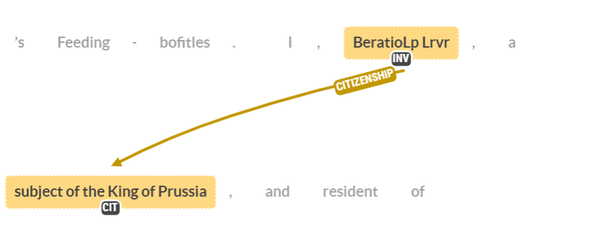
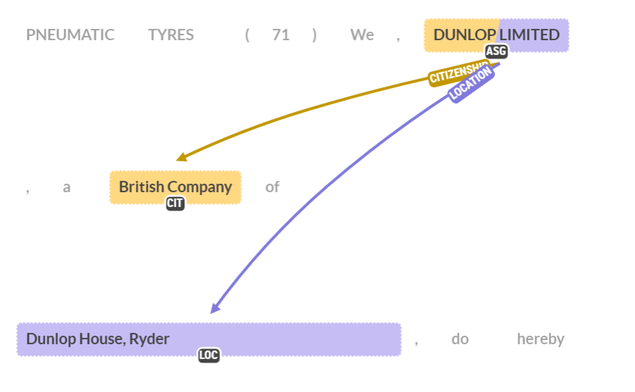
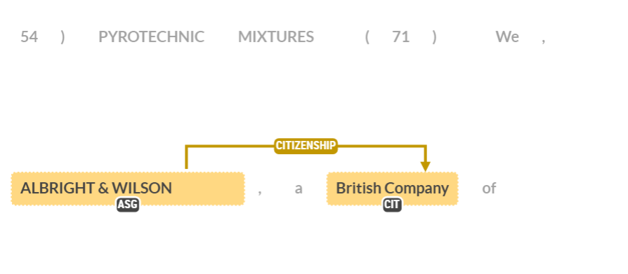
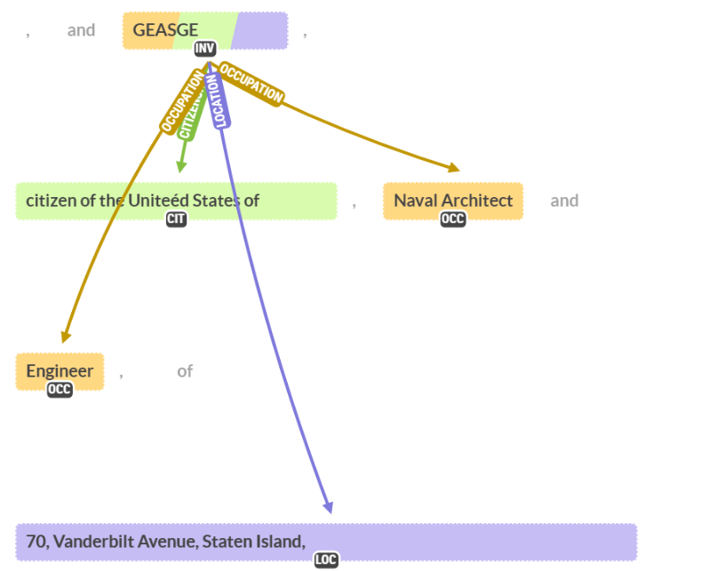
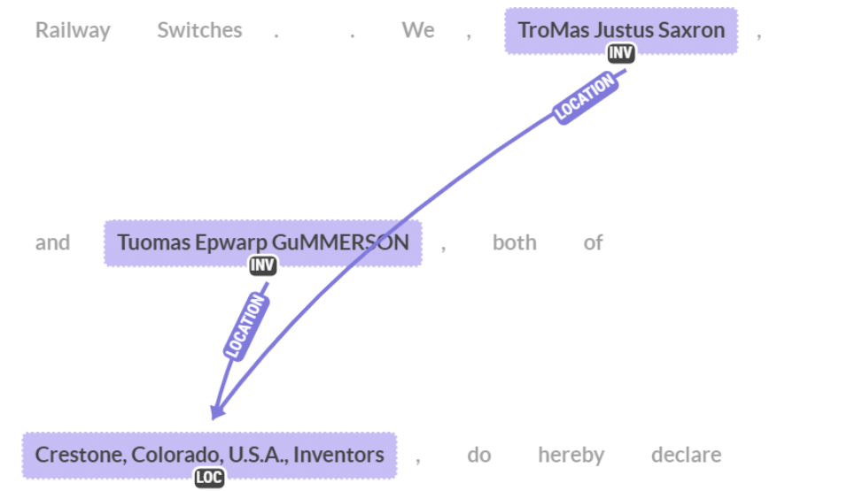
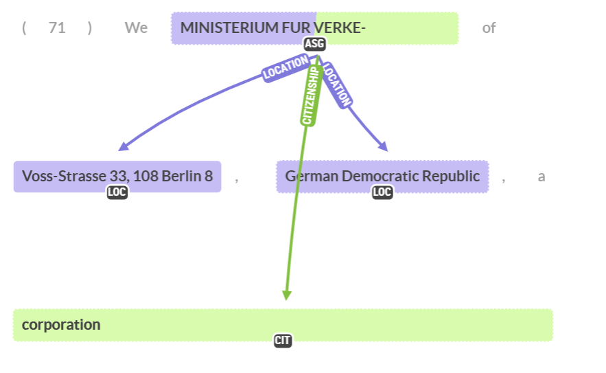

# RELATIONSHIP ANNOTATION GUIDELINES

## Preliminary comments

Each corpus has its specific set of relationship that is detailed in a separate document :
* [US](US_ANNOTATION_GUIDELINES.md)
* [GB](GB_ANNOTATION_GUIDELINES.md)
* [FR](FR_ANNOTATION_GUIDELINES.md)
* [DE](DE_ANNOTATION_GUIDELINES.md)
* [DD](DD_ANNOTATION_GUIDELINES.md)

## General rule

The labelling of relationship between entities follow the general rule that the relation should go from the object to its attributes. For example, in the case of a link between an entity `LOC`
and an entity `INV`, the relationship should go from `INV` to `LOC`.

## Specific rules

From the set of annotated entities, the context should be sufficient to use the general rule without ambiguity. Standard cases are presented in Examples 1 to 3 below.
Two specific cases are worth mentionning:
* Multiple similar objects for a given subject (e.g. two `LOC` for a same `ASG`)
* Multiple subjects for a given object (e.g. two INV for a same `CIT`)

These cases can happen for two reasons, either because the context commands it (see examples 4 and 5) or because one of the entities has been split into multiple parts for example because of a bad OCR, or because of the wording (see example 6).

In any cases, all the corresponding relationship should be annotated.

## Examples

### Example 1

### Example 2

### Example 3

### Example 4

### Example 5

### Example 6

